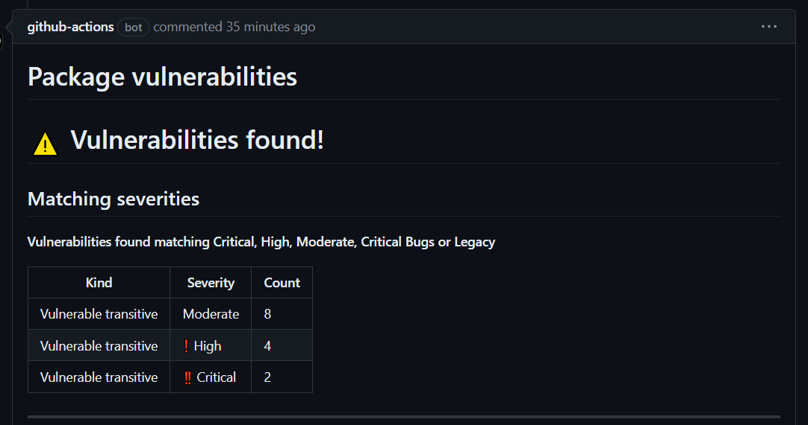
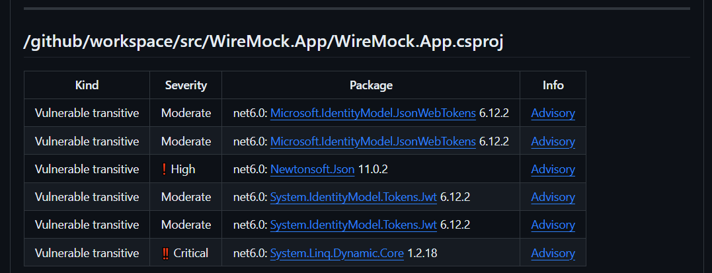
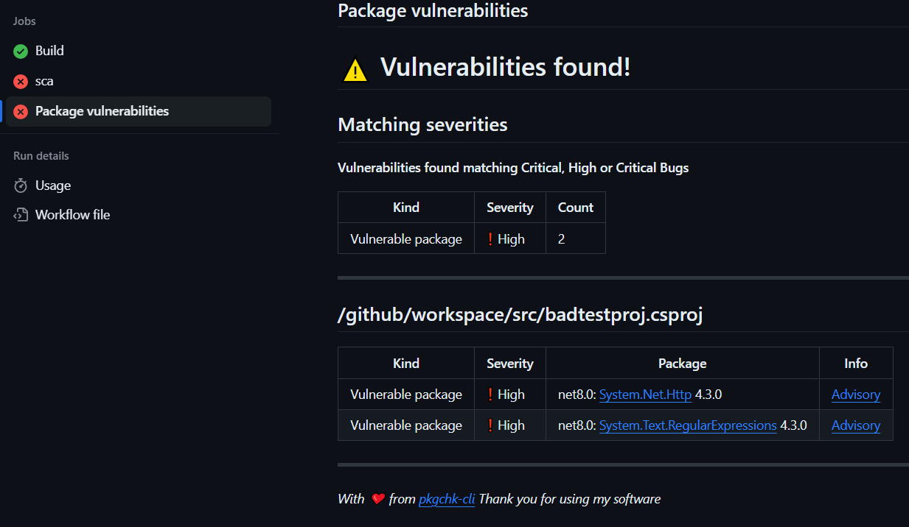

# pkgchk-action

A Github action to perform .Net package dependency checks & PRs.






## How to use

Your repository `Workflow permissions` settings should give `Read and write permissions` to the `GITHUB_TOKEN`.

Once done, simply include the action in your workflow like so:

```yaml
- uses: actions/checkout@v4

- name: Run SCA
  uses: tonycknight/pkgchk-action@v1.0.19
```

Use the step in your PR checks, or in your regular build workflow checks:




:warning: This action only works with .Net SDK 8. Check your `global.json` and other settings to avoid incompatibilities.

## What the options mean

The main options you'll need to provide are below. Most options have defaults applied, giving scans for high to critical vulnerabilities.

| The option  | What's it for?  | What's the default? |
| - | - | - |
| `project-path` | The relative path to the solution or project | The solution file in the working directory.  |
| `deprecated` | Include deprecated packages in the scan | `false` |
| `vulnerable` | Include vulnerable packages in the scan | `true` |
| `transitives` | Include transitive packages in the scan | `true` |
| `fail-on-critical` | Fail scans if critical severity vulnerabilities or deprecation reasons are found | `true` |
| `fail-on-high` | Fail scans if high severity vulnerabilities are found | `true` |
| `fail-on-moderate` | Fail scans if moderate severity vulnerabilities are found | `false` |
| `fail-on-legacy` | Fail scans if packages are found to be deprecated for legacy reasons | `false` |
| `pass-img` | URI of a report image for successful scans | |
| `fail-img` | URI of a report image for failed scans | |
| `restore-solution` | Restore the solution or project | `true` |
| `restore-tools` | Restore tools | `true` |

Some options are available to control the action's credentials, tracing, etc. You shouldn't need to use this in most cases.

| The option  | What's it for?  | What's the default? |
| - | - | - |
| `github-token` | A github token to push reports to PRs | `github.token` |
| `repo` | The repository name in `owner/repo` form | `github.repository` |
| `github-title` | The title to give to the PR report | `Package vulnerabilities` |
| `prid` | The pull request ID | `github.event.number` | 
| `commit-hash` | The Github commit hash | `github.sha` |
| `trace` | Output trace logging to the console | `false` |


## Some examples

### What's the minimum I need?

You'll need to first `checkout` the repository. The default options will scan for High and Critical vulnerabilities.

```yaml
- uses: actions/checkout@v4

- name: Run SCA
  uses: tonycknight/pkgchk-action@v1.0.19
```

### I want to scan a specific project

```yaml
- uses: actions/checkout@v4

- name: Run SCA
  uses: tonycknight/pkgchk-action@v1.0.19
  with:
    project-path: src/testproj.csproj
```

### I want to scan for every possible problem

Easy: ensure `vulnerable`, `deprecated` & `transitives` are `true`, and all the `fail-on-` options are also `true`:

```yaml
- uses: actions/checkout@v4

- name: Run SCA
  uses: tonycknight/pkgchk-action@v1.0.19
  with:
    vulnerable: true
    deprecated: true
    transitives: true
    fail-on-critical: true
    fail-on-high: true
    fail-on-moderate: true
    fail-on-legacy: true
```

### I want to put images on the report

Simple: just set URLs to the `pass-img` and `fail-img` parameters, like so:

```yaml
- uses: actions/checkout@v4

- name: Run SCA
  uses: tonycknight/pkgchk-action@v1.0.19
  with:
    pass-img: https://media.tenor.com/4h0Z--sGHgsAAAAC/jason-momoa-folding-chair.gif
    fail-img: https://i.pinimg.com/474x/b4/74/fe/b474fe41f458a648fcfac0145a4dbd2e.jpg
```


## Licence

`pkgchk-action` is licenced under MIT.

For `pkgchk-cli` refer to [its own licencing](https://github.com/tonycknight/pkgchk-cli).

